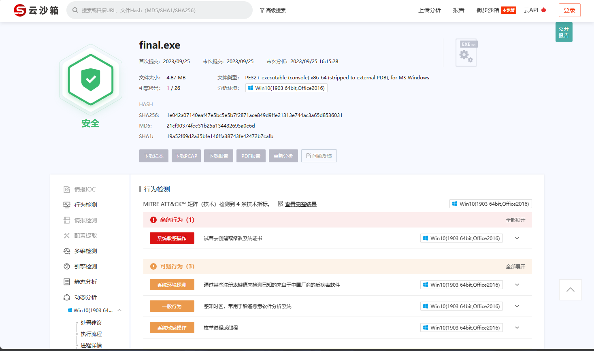
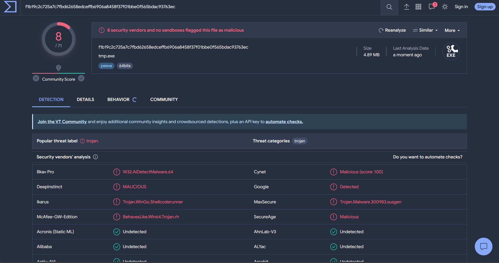
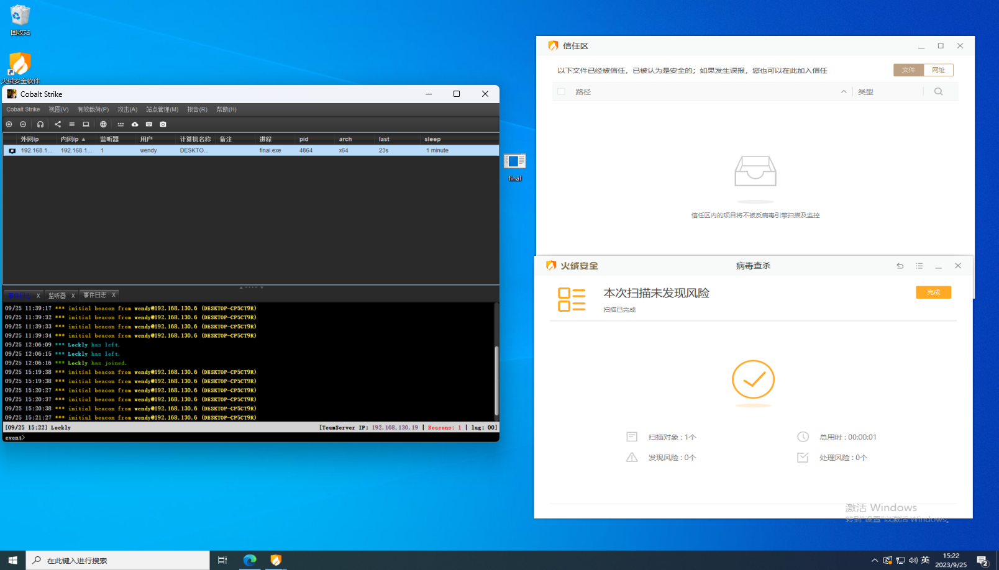
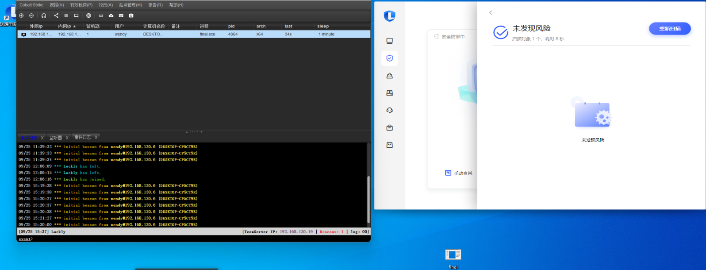

# gobypass
远程加载shellcode

> 学习免杀中，很多不足的地方望师傅们多指教

## 使用
先将payload.bin(文件名不要改动)放到根目录下，再编译运行main.go，会产生一个output目录，其中有使用AES + Base85加密了的shellcode(在服务器要提供此文件下载), 以及最终的loader。

## 测试
截止上传此项目时只测了火绒，联想电脑管家，微步和vt。

微步1/26

vt 就不容乐观 8/71

火绒，联想电脑管家动静均无感

